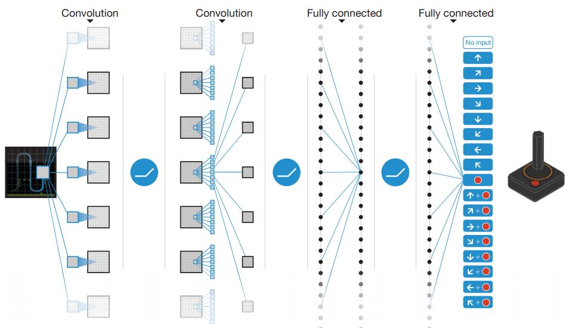
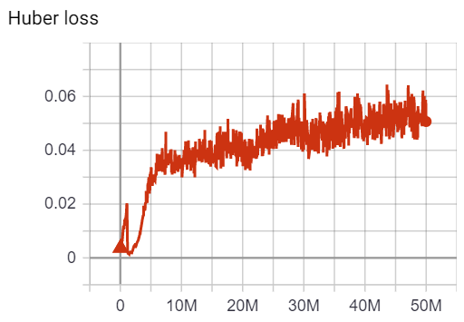
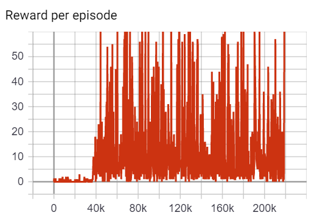
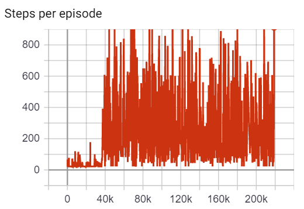
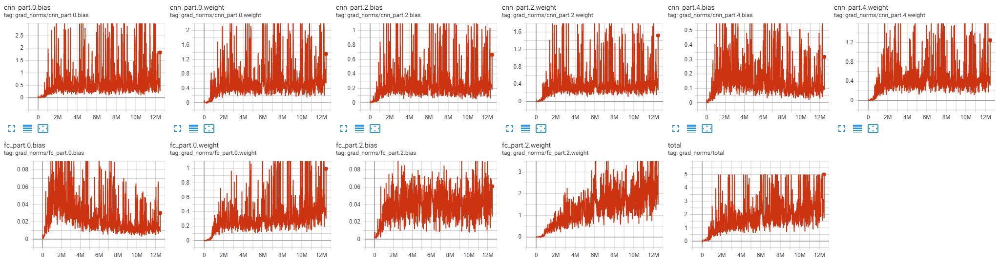
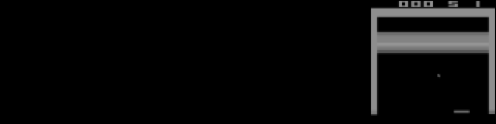
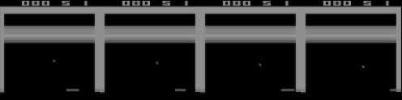
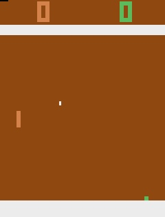
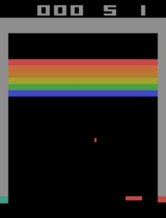
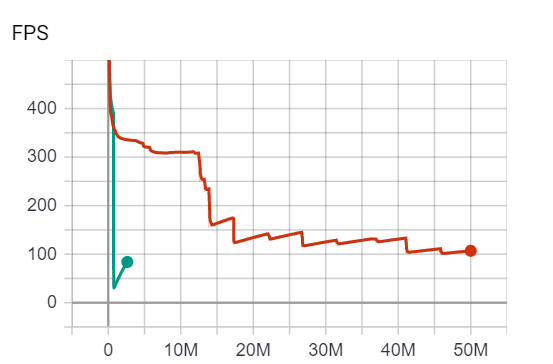

## Reinforcement Learning (PyTorch) :robot: + :cake: = :heart:

This repo will contain PyTorch implementation of various fundamental RL algorithms. <br/>
It's aimed at making it **easy** to start playing and learning about RL. <br/>

The problem I came across investigating other DQN projects is that they either:
* Don't have any evidence that they've actually achieved the published results 
* Don't have a "smart" replay buffer (i.e. they allocate (1M, 4, 84, 84) ~ 28 GBs! instead of (1M, 84, 84) ~ 7 GB)
* Lack of visualizations and debugging utils

This repo will aim to solve these problems.

## Table of Contents
* [RL agents](#rl-agents)
    * [DQN](#dqn)
    * [DQN current results](#dqn-current-results)
* [Setup](#setup)
* [Usage](#usage)
    * [Training DQN](#training-dqn)
    * [Visualization and debugging tools](#visualization-and-debugging-tools)
* [Hardware requirements](#hardware-requirements)
* [Future todos](#future-todos)
* [Learning material](#learning-material)

## RL agents 

## DQN

This was the project that started the revolution in the RL world - deep Q-network (:link: [Mnih et al.](https://storage.googleapis.com/deepmind-media/dqn/DQNNaturePaper.pdf)), <br/>
aka "Human-level control through deep RL".

DQN model learned to play **29 Atari games** (out of 49 they it tested on) on a **super-human**/comparable-to-humans level.
Here is the schematic of it's CNN architecture:

<p align="center">

</p>

The fascinating part is that it learned only from "high-dimensional" (84x84) images and (usually sparse) rewards.
The same architecture was used for all of the 49 games - although the model has to be retrained, from scratch, every single time.

## DQN current results

Since it takes [lots of compute and time](#hardware-requirements) to train all of the 49 models I'll consider this DQN project completed once
I succeed in achieving the published results on:
* Breakout
* Pong

---

Having said that the experiments are still in progress, so feel free to **contribute**!
* For some reason the models aren't learning very well so if you find a bug open up a PR! :heart:
* I'm also experiencing slowdowns - so any PRs that would improve/explain the perf are welcome!
* If you decide to train the DQN using this repo on some other Atari game I'll gladly check-in your model!

**Important note: please follow the coding guidelines of this repo before you submit a PR so that we can minimize
the back-and-forth. I'm a decently busy guy as I assume you are.**

### Current results - Breakout

<p align="center">

</p>

As you can see the model did learn something although it's far from being really good.

### Current results - Pong

todo

## Setup

Let's get this thing running! Follow the next steps:

1. `git clone https://github.com/gordicaleksa/pytorch-learn-reinforcement-learning`
2. Open Anaconda console and navigate into project directory `cd path_to_repo`
3. Run `conda env create` from project directory (this will create a brand new conda environment).
4. Run `activate pytorch-rl-env` (for running scripts from your console or setup the interpreter in your IDE)

If you're on Windows you'll additionally need to install this:
`pip install https://github.com/Kojoley/atari-py/releases atary_py` to install gym's Atari dependencies.

Otherwise this should do it `pip install 'gym[atari]'`, if it's not working check out [this](https://stackoverflow.com/questions/49947555/openai-gym-trouble-installing-atari-dependency-mac-os-x) and [this](https://github.com/openai/gym/issues/1170).

That's it! It should work out-of-the-box executing environment.yml file which deals with dependencies. <br/>

-----

PyTorch pip package will come bundled with some version of CUDA/cuDNN with it,
but it is highly recommended that you install a system-wide CUDA beforehand, mostly because of the GPU drivers. 
I also recommend using Miniconda installer as a way to get conda on your system.
Follow through points 1 and 2 of [this setup](https://github.com/Petlja/PSIML/blob/master/docs/MachineSetup.md)
and use the most up-to-date versions of Miniconda and CUDA/cuDNN for your system.

## Usage

#### Option 1: Jupyter Notebook

Coming soon.

#### Option 2: Use your IDE of choice

You just need to link the Python environment you created in the [setup](#setup) section.

## Training DQN

To run with default settings just run `python train_DQN_script.py`.

Settings you'll want to experiment with:
* `--seed` - it may just so happen that I've chosen a bad one (RL is very sensitive)
* `--learning_rate` - DQN originally used RMSProp, I saw that Adam with 1e-4 worked for stable baselines 3
* `--grad_clipping_value` - there was [a lot of noise](#visualization-tools) in the gradients so I used this to control it
* Try using RMSProp (I haven't yet). Adam was an improvement over RMSProp so I doubt it's causing the issues

Less important settings for getting DQN to work:
* `--env_id` - depending on which game you want to train on (I'd focus on the easiest one for now - Breakout)
* `--replay_buffer_size` - hopefully you can train DQN with 1M, as in the original paper, if not make it smaller
* `--dont_crash_if_no_mem` - add this flag if you want to run with 1M replay buffer even if you don't have enough RAM

The training script will:
* Dump checkpoint *.pth models into `models/checkpoints/`
* Dump the best (highest reward) *.pth model into `models/binaries/` <- TODO
* Periodically write some training metadata to the console
* Save tensorboard metrics into `runs/`, to use it check out [the visualization section](#visualization-tools)

## Visualization and debugging tools

You can visualize the metrics during the training, by calling `tensorboard --logdir=runs` from your console
and pasting the `http://localhost:6006/` URL into your browser.

I'm currently visualizing the [Huber loss](https://en.wikipedia.org/wiki/Huber_loss) (and you can see there is something weird going on):

<p align="center">

</p>

Rewards and steps taken per episode (there is a fair bit of correlation between these 2):

<p align="left">


</p>

And gradient L2 norms of weights and biases of every CNN/FC layer as well as the complete grad vector:

<p align="center">

</p>

As well as epsilon (from the epsilon-greedy algorithm) but that plot is not that informative so I'll omit it here.

As you can see the plots are super **noisy**!, as I could have expected, but the progress just stagnates from certain point onwards
and that's what I'm trying to debug atm.

---

To enter the debug mode add the `--debug` flag to your console or IDE's list of script arguments.

It'll visualize the current state that's being fed into the RL agent. 
Sometimes the state will have some black frames prepended since there aren't enough frames experienced in the current episode:

<p align="center">

</p>

But mostly all of the 4 frames will be in there:

<p align="center">

</p>

And it will start rendering the game frames (`Pong` and `Breakout` showed here from left to right):

<p align="left">


</p>

## Hardware requirements

You'll need some decent hardware to train the DQN in reasonable time so that you can iterate fast:
1) **16+ GB of RAM** (Replay Buffer takes around ~7 GBs of RAM).
2) The faster your GPU is - the better! :sweat_smile: Having said that VRAM is not the bottleneck you'll need **2+ GB VRAM**.

With 16 GB RAM and RTX 2080 it takes ~5 days to train DQN on my machine - I'm **experiencing some slowdowns** which I
haven't debugged yet. Here is the FPS (frames-per-second) metric I'm logging:

<p align="center">

</p>

The shorter, green one is the current experiment I'm running, the red one took over 5 days to train.

## Future todos

1) Debug DQN and achieve the published results
2) Add Vanilla PG
3) Add PPO

## Learning material

Here are some videos I made on RL which may help you to better understand how DQN and other RL algorithms work:

<p align="left">
<a href="https://www.youtube.com/watch?v=H1NRNGiS8YU" target="_blank"></a>
</p>

And some other ones:
* [DeepMind: AlphaGo](https://www.youtube.com/watch?v=Z1BELqFQZVM)
* [DeepMind: AlphaGo Zero and AlphaZero](https://www.youtube.com/watch?v=0slFo1rV0EM)
* [OpenAI: Solving Rubik's Cube with a Robot Hand](https://www.youtube.com/watch?v=eTa-k1pgvnU)
* [DeepMind: MuZero](https://www.youtube.com/watch?v=mH7f7N7s79s)

And in this one I tried to film through the process while the project was not nearly as polished as it is now:
* [DQN project update](https://www.youtube.com/watch?v=DrOp_MQGn9o&ab_channel=TheAIEpiphany)

I'll soon create a blog on how to get started with RL - so stay tuned for that!

## Acknowledgements

I found these resources useful while developing this project, sorted (approximately) by usefulness:

* [Stable Baselines 3 DQN](https://github.com/DLR-RM/stable-baselines3/blob/master/stable_baselines3/dqn/dqn.py)
* [PyTorch reimplementation of Berkley's DQN](https://github.com/transedward/pytorch-dqn) and [Berkley's DQN](https://github.com/berkeleydeeprlcourse/homework/tree/master/hw3)
* [pytorch-dqn](https://github.com/jacobaustin123/pytorch-dqn/blob/master/dqn.py)
* [RL adventures DQN](https://github.com/higgsfield/RL-Adventure/blob/master/1.dqn.ipynb) and [minimal DQN](https://github.com/econti/minimal_dqn/blob/master/main.py)
* [Pytorch tutorial](https://pytorch.org/tutorials/intermediate/reinforcement_q_learning.html)

## Citation

If you find this code useful, please cite the following:

```
@misc{Gordić2021PyTorchLearnReinforcementLearning,
  author = {Gordić, Aleksa},
  title = {pytorch-learn-reinforcement-learning},
  year = {2021},
  publisher = {GitHub},
  journal = {GitHub repository},
  howpublished = {\url{https://github.com/gordicaleksa/pytorch-learn-reinforcement-learning}},
}
```

## Licence

[](https://github.com/gordicaleksa/pytorch-learn-reinforcement-learning/blob/master/LICENCE)